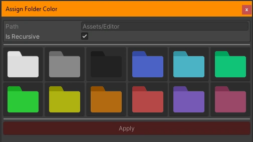

# Color Folders

| [Usage](Docs_ColorFolders.md) | [API](API_ColorFolders.md) |

An editor enhancement to add colored folders to your projects folder structure for ease of navigation when deep in a folder structure.

|             |                        |
|-------------|:-----------------------|
| Author      | `J, (Carter Games)`    |
| Revision    | `2`                    |
| Last update | `2025-08-10`           |

<br/>

### Limitations
- This crate removes the differing icons based on if a folder is open or empty to apply the color effects. 

---
<br/>

---

###  Apply a color to a folder
To apply a color, select the folder you want to color and right-click to open the context menu. Then navigate to the `````Color Folders````` option and select the ```Set Folder Color``` option.

You can also reset a folder color from the same menu should you want to revert a color. 

> <b>Note:</b> This may only work on the folders you originally colored.

Once pressed you’ll get a popup where to can choose if the color should apply recursively, so it all folders underneath unless overridden with another color change. You will need to select a style to apply a color to the folder. Select from the styles by pressing the select style button and selecting an option. Once done, press ```apply``` to change to color. 



---