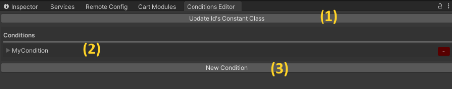

# Conditions

| [Usage](Docs_Conditions.md) | [API](API_Conditions.md) |

The conditions system is designed to let you define boolean checks based on runtime criteria. Useful for abstracting checks from their systems and making them easier to debug.


|             |                     |
|-------------|:--------------------|
| Author      | `J, (Carter Games)` |
| Revision    | `3`                 |
| Last update | `2026-??-??`        |

<br/>


### Editor window
Conditions are defined and edited in the conditions editor window. This can be found under: `Tools/Carter Games/The Cart/Crates/Conditions/Editor`. From the window you have 3 main sections:



1. Press to update a constants class which is handy for referencing condition id’s without any issues.
2. The area that shows all the conditions you have defined in dropdowns.
3. Press to make a new condition.

<br/>

### Making a condition
To make a new condition, press the `Add new condition` option in the condtions editor window. This will generate a new condition asset with no criteria assigned. The condition will have a random guid assigned as its id & asset name. To make the condition have a readable name, just enter a valid into the condition key field. This will also update the condition asset with the change so you can easily identify it in the project.

All conditions assets are stored under: `Assets/Plugins/Carter Games/The Cart/Crates/Conditions/` when generated.

<br/>

### Adding criteria
You can add criteria to a condtion via the condtions editor window. Navigate to the condition and expand it out to see the assigned criteria. You can add a criteria to a condition with the `+Add criteria` button. Each criteria can be read in an inverted state should that be needed. If you want to group criteria together you can press the add group button and select the group you wish to add that criteria to. Selecting the new group option will make a new group and add the criteria to the newly made group. Each group is numbered by default, but you can give it a display name for readability should you wish. 


With a condition open you can see all the criteria for that condition and their settings. 


<br/>

When a criteria is in a group it’ll appear in a separate section. Each group can be toggled in its passing
check. This can be:

| Check Type            | Description                    |
|-------------|:--------------------|
| All      | All criteria in the group must pass for the group to pass. |
| Any    | Any criteria passing in the group will pass the group.                |
| None | All criteria in the group must NOT pass for the group to pass.       |
| All or None | All criteria in the group must either pass or NOT pass for the group to pass. If there is a mix then it will no pass the group.       |

You can change the group passing state method by pressing the orange current state button on the group.

<br/>

### Condition constants
For ease of use, there is a constants class with the setup that you can popuplate from the conditions editor window. When generated it will give readable condition references that can be used in your code to listen for condition state changes by name instead of its id which is less readable. The class can be found at `Assets/Plugins/Carter Games/The Cart/Crates/Conditions/Constants/` when generated.

<br/>

### Criteria
You can make you own criteria to use with the conditions crate by making a new class that inherits from the `Criteria` abstract class and implementing its required information. After making the class it will appear as an option to select when assigning criteria. Fields or properties you add must not be serailized unless exposed to the inspector for settings. This is to avoid data been kept between plays. You will see a warning if a criteria is not valid in the conditions editor window. 

An example implementation:

```csharp
/// <summary>
/// A criteria for a coin flip ture/false.
/// </summary>
[Serializable]
public sealed class CriteriaCoinFlip : Criteria
{
    /* ─────────────────────────────────────────────────────────────────────────────────────────────────────────────
    |   Fields
    ───────────────────────────────────────────────────────────────────────────────────────────────────────────── */
    
    [NonSerialized] private bool flippedHeads;
    
    /* ─────────────────────────────────────────────────────────────────────────────────────────────────────────────
    |   Properties
    ───────────────────────────────────────────────────────────────────────────────────────────────────────────── */
    
    protected override bool Valid => flippedHeads;

    /* ─────────────────────────────────────────────────────────────────────────────────────────────────────────────
    |   Methods
    ───────────────────────────────────────────────────────────────────────────────────────────────────────────── */
    
    public override void OnInitialize(Evt stateChanged)
    { 
        flippedHeads = Rng.Bool();
        stateChanged.Raise();
    }
}
```

<br/>

### Query a condition in code
To check the state of a condition, call `ConditionManager.IsTrue()` and pass in the condition id you want to check. 

To listen for changes to a condtion, call `ConditionManager.SubscribeValidStateChange()` and pass in the condition id to check for and the action to run whenever the condition resolves to a new boolean state. You can remove a listener with the `ConditionManager.UnsubscribeValidStateChange()` method which takes the same parameters as the register method does. 


