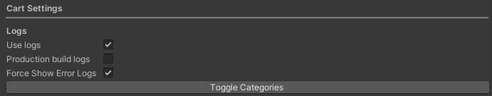
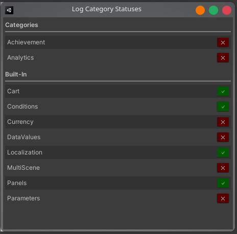

# Logging

| [Usage](Docs_Logging.md) | [API](../../../../Docs/API/Cart/Runtime/API_Logging.md) |

Provides a logging system that can be toggled and modularized to show only certain categories of logs at a time.

|             |              |
|-------------|:-------------|
| Revision    | `1`          |
| Last update | `2026-04-28` |

<br/>

### Settings
The settings for the logging setup can be found under:

```
[Project Settings] Carter Games > The Cart
[Nav Menu] Tools > Carter Games > The Cart > Edit Settings
```

<br/>

In the main tab for the cart you'll see the library settings.
This is where you'll find the logs settings.

| Setting               | Description                                                              |
|-----------------------|:-------------------------------------------------------------------------|
| Use logs              | A master toggle to turn on/off all logs in the library.                  |
| Production build logs | Defines if logs show in production builds.                               |
| Force show error logs | Defines if error logs will always be shown regardless of other settings. |
| Toggle categories     | Press to open the GUI to toggle log categories.                          |




<br/>

### Toggle categories
You can toggle each category from the statues window. This is accessible from:

```
[Project Settings] Carter Games > The Cart > Cart Settings > Logging > Toggle Categories
[Nav Menu] Tools > Carter Games > The Cart > [Logging] Category Window
```



This will show all categories found in the project and let you toggle each one 
on or off with the right hand side buttons. Your categories will appear at the
top while the libraries built-in ones appear in their own section at the bottom.
All logs in the cart library use this system over standard debug logs where possible.

<br/>

### Custom categories
You can create your own categories by making a class that inherits 
from the `LogCategory` class. The class doesn't need any logic 
and should be left totally empty. You can optionally apply `sealed` to the class
too to avoid inheritance from your logging classes. 
Inheriting from a log category implementing class will not work.