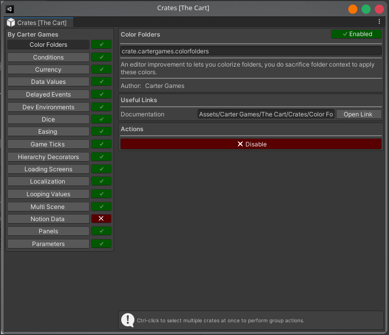

# Crates

Crates are scripts or systems that are optional. These may not be needed for every project and therefore can be toggled at will. Crates can be managed from the crate window under:

```
Tools/Carter Games/The Cart/Crate Manager
```

The window will look something like this:



All crates in the project will be visible from this window, ordered by the author of the crate. Both internal & external crates by an author will be displayed together under the same author grouping. 

To enable a crate, just select it from the list on the left side and press the enable action at the bottom of its details shown on the right hand side. If the crate is an extenral crate, the package for it will import as a part of the enabling process.
