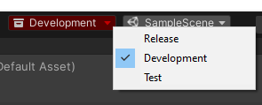

# Dev Environments

Author: `Carter Games`

Dev environments is designed to give a you a way to define different build types in code and limit some functionality to those environments. 


## Defined environments
All environments in the crate are pre-defined. It is not intended to add extra in the design of this crate.

| Environment  | Description  |
|--------------|:------------|
| `Release` | Intended for release builds of the projects. 
| `Development` | Intended for builds when making the project and developing new features. 
| `Test` | Indented for builds that are similar to release, but with testing tools or settings enabled to check things over.


<br/>
### Switching environments

You can switch environment from the toolbar in the editor next to the scene switching button. You will be prompted to confirm switching environment when doing so. The button will display the current environment as well.




<br/>
## Scripting API

---

Assembly: ```CarterGames.Cart.Crates```

Namespace: ```CarterGames.Cart.Crates.DevEnvironments```

<br/>
### Environment detection
Use the static ```EnvironmentDetection``` class to get which environment is currently in use in code. 


---

### ```CurrentEnvironment {get}```
Gets the environment the project is currently targeting.

Example:

```csharp
private void OnEnable()
{
    Debug.Log(EnvironmentDetection.CurrentEnvironment);
}
```
